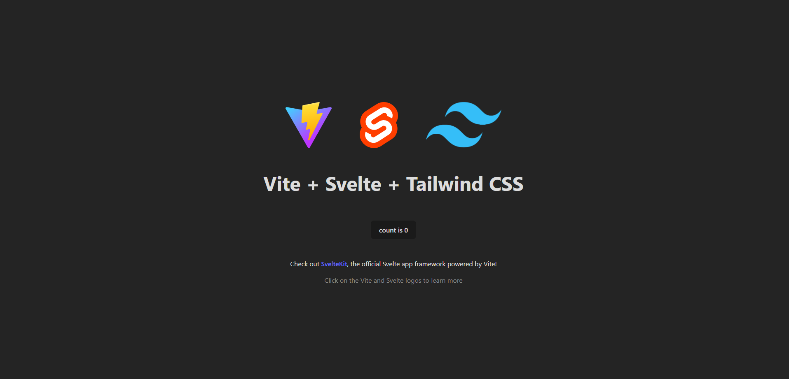

<!-- badges -->

"[Svelte](https://svelte.dev/) is a tool for building web applications. Like other user interface frameworks, it allows you to build your app _declaratively_ out of components that combine markup, styles, and behaviours."

This guide provides a first-hand experience on building a Svelte project using [Svelte](https://svelte.dev/) + [Tailwind CSS](https://tailwindcss.com/docs/guides/sveltekit) and deploying it on [GitHub Pages](https://pages.github.com/).

## 🛠️ Installation

**1. Create your project.**

```bash
# terminal
npm create vite@latest project_name -- --template svelte
cd project_name
```

**2. Install Tailwind CSS.**

```bash
# terminal
npm install -D tailwindcss postcss autoprefixer
npx tailwindcss init -p
```

**3. Configure your template paths.**

```js
// tailwind.config.js
/** @type {import('tailwindcss').Config} */
export default {
  content: ['./src/**/*.{html,js,svelte,ts}'],
  theme: {
    extend: {},
  },
  plugins: [],
};
```

**4. Add the Tailwind directives to your CSS.**

```css
/* app.css */
@tailwind base;
@tailwind components;
@tailwind utilities;
```

**5. Start your build process.**

```bash
# terminal
npm run dev
```

**6. Start coding.**

```html
<h1 class="text-3xl font-bold underline">Hello world!</h1>
```

## 🗂️ File Structure

Feel free to customize your file structure or follow this from [MDN](https://developer.mozilla.org/en-US/docs/Learn/Tools_and_testing/Client-side_JavaScript_frameworks/Svelte_getting_started#application_structure).

```
my-project/
├── README.md
├── package.json
├── package-lock.json
├── rollup.config.js
├── .gitignore
├── node_modules
├── public
│   ├── favicon.png
│   ├── index.html
│   ├── global.css
│   └── build
│       ├── bundle.css
│       ├── bundle.js
│       └── bundle.js.map
├── scripts
│   └── setupTypeScript.js
└── src
    ├── App.svelte
    └── main.js
```

## 🛫 How to deploy to GitHub Pages
